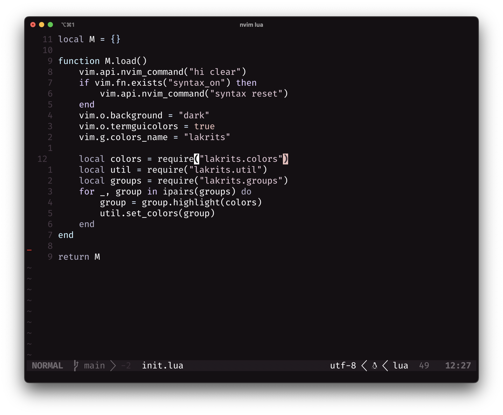

<div align="center">
<h1>Lakrits</h1>

<h4>A dark, licorice inspired, color scheme for nvim.</h4>
</div>




## Installation

- Packer: `require("samkaj/lakrits.nvim")`

## Usage

To load the colorscheme, put the line below and make sure it is loaded in your `init.vim`/`init.lua`:

```lua
-- lua
vim.cmd[[colorscheme lakrits]]
```

```vim
;; vimscript
colorscheme lakrits
```

## Future support

- Lualine
- Mason
- Telescope
- Git
- Harpoon
- Treesitter
